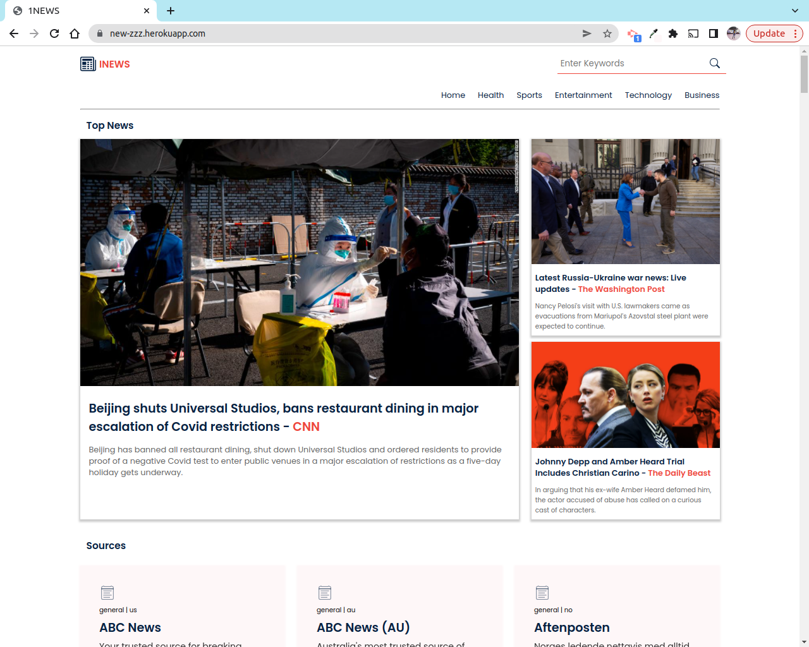
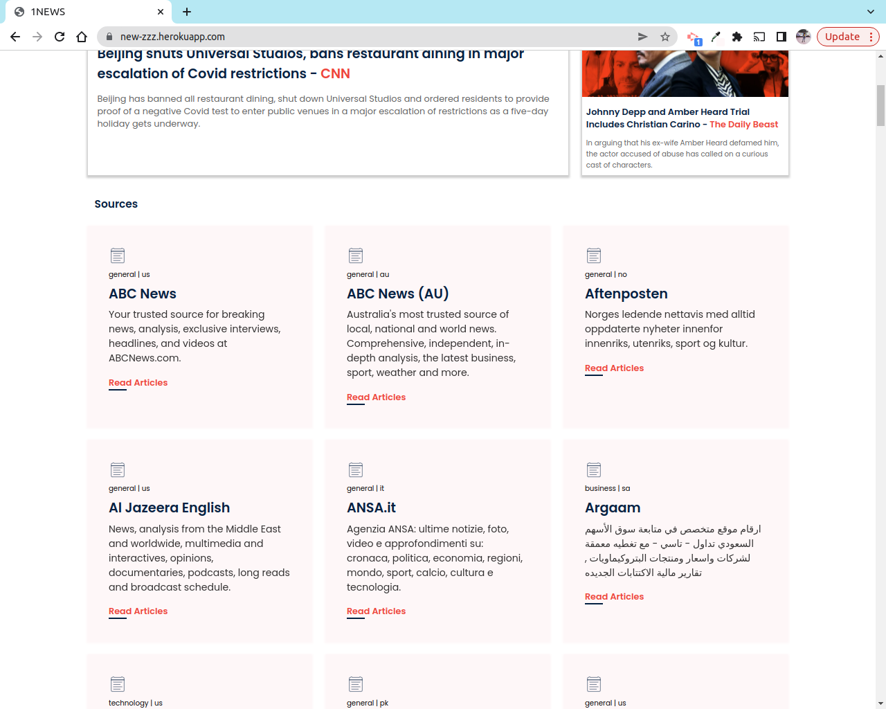

# news

## Table of Content

- [Description](#description)
- [Installation Requirement](#Installation)
- [Technology Used](#technology-used)
- [Reference](#reference)
- [Licence](#licence)
- [Authors Info](#author-Info)
- [ToDO](#To-Do)

 
<h1>Home</h1>

 
 

<h1>various sources of news </h1>

 
 

<h1>articles by various sources</h1>

 
 

<h1>Entertainment page</h1>

## Description

New-zzz is an apllication that consumes news API to display news articles from various sources in different categories such as business, sports, entertainment ,health and technology 

## Installation

<code>
<ul>
<li>Git clone This repo.</li>
<li>python3 -m venv virtual - to install virtual enviroment.</li>
<li>Source virtual/bin/activate - to install flask.</li>
<li>pip list to show all needed packages are installed inside the virtual environment.</li>
<li>Head over to newsAPI documentation to get an API key and you are good to go.</li>
</ul>
</code>

## Technology Used

<ul>
<li>
python3.9.5
<li>
<li>
Flask 2.0.0
<li>
pip3
<li>

</ul>

## Reference

- <a href="https://newsapi.org/docs">News API documentation</a>

## Licence

   copyright © Charity 2022 - <a href="https://github.com/charity-bit/news/blob/main/LICENSE">MIT</a>

## Authors Info

-LinkedIn - [Charity Nyanchera](https://www.linkedin.com/in/charitynyanchera

-twitter - [CcNyanchera](https://twitter.com/CcNyanchera)

-[Go Back to the top](#news)
